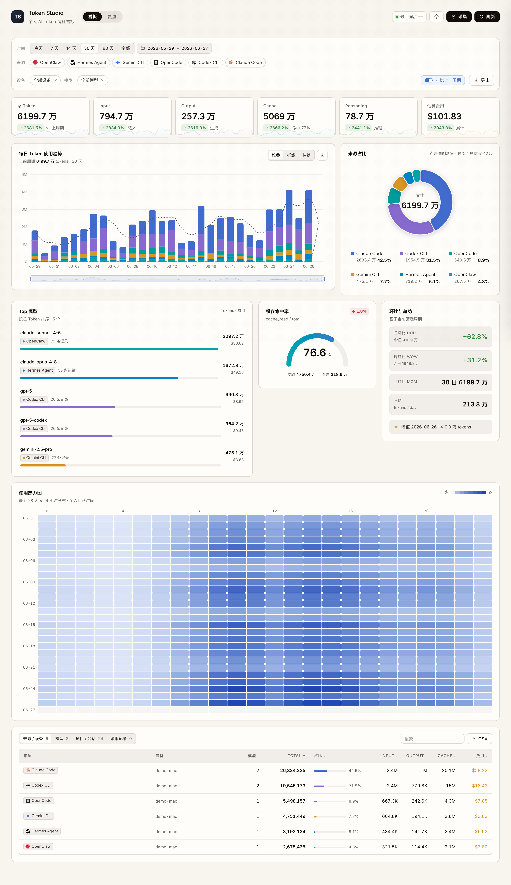

# AI Token Dashboard

**English** | [中文](README.md)

[](LICENSE)
[](https://nodejs.org)

A lightweight, privacy-first dashboard for tracking your local AI token usage across multiple agents and CLI tools.

Reads session logs directly from your machine, aggregates them into a local SQLite database, and serves a React UI — **no cloud, no telemetry, no third-party uploads by default.**

---

## Screenshots



> _Illustrative, using demo data._

---

## Features

- **Multi-source collection** — Claude Code, Codex CLI, Gemini CLI, Hermes Agent, OpenClaw
- **Two views** — interactive usage dashboard (`/`) and a printable retrospective page (`/review`)
- **Cost tracking** — per-model cost estimation via bundled LiteLLM + OpenRouter pricing caches
- **In-app collection** — trigger a local collection run from the dashboard's top-right **Collect** button (loopback only)
- **Multi-device** — optional push mode to aggregate usage from multiple machines into a single hub
- **Docker-ready** — one-command deployment as a central ingest server
- **Pure JavaScript** — no Rust toolchain, no native binaries, no extra CLIs required

---

## Supported Data Sources

| Tool | Data location |
|------|--------------|
| [Claude Code](https://claude.ai/code) | `~/.claude/projects/` |
| [Codex CLI](https://github.com/openai/codex) | `~/.codex/sessions/` |
| [Gemini CLI](https://github.com/google-gemini/gemini-cli) | `~/.gemini/tmp/` |
| Hermes Agent | `~/.hermes/state.db` (or `$HERMES_HOME/state.db`) |
| OpenClaw | `~/.openclaw/agents/` |

Only the tools you actually have installed will produce data — others are silently skipped.

---

## Requirements

- **Node.js ≥ 22.5.0** (uses the built-in `node:sqlite` module)

---

## Quick Start

```bash
# 1. Install dependencies
npm install

# 2. Collect usage data from all local tools
npm run collect

# 3. Build the frontend
npm run build

# 4. Start the server
npm run serve
```

Open in your browser:

```
http://localhost:4173        # Usage dashboard
http://localhost:4173/review # Retrospective view
```

Usage data is written to `data/usage.sqlite`. The `data/` directory is gitignored and stays local.

### Development

```bash
npm run dev   # Start both the API server and the Vite dev server
```

Development mode uses two ports:

```
http://localhost:4173 # API server
http://localhost:5173 # Vite frontend with HMR
```

You can also start them separately:

```bash
npm run dev:server # API server only, default port 4173
npm run dev:client # Vite frontend only, port 5173
```

The dashboard's **Collect** button calls `POST /api/collect` and polls `GET /api/collect/status`. The collect endpoint is restricted to loopback requests.

---

## Multi-Device Setup

Collect from multiple machines and aggregate into a single dashboard.

**1. Start the hub on your central device:**

```bash
INGEST_TOKEN="your-secret-token" npm run serve
```

**2. On each device that uses AI tools, run collect with push:**

```bash
npm run collect -- \
  --device "my-laptop" \
  --push http://your-hub-host:4173/api/ingest \
  --token "your-secret-token"
```

The hub merges all devices' daily and session records into one SQLite database and displays them together in the UI.

---

## Docker

Best suited for running the hub/ingest server:

```bash
INGEST_TOKEN="your-secret-token" docker compose up -d
```

Data is written to the mounted `./data` volume. **Local log collection should run on the host**, as agent session files live in the host user's home directory.

### Scheduled Collection

The server has built-in scheduled collection. It is disabled by default. Once enabled, the server runs local collection at the configured interval; Docker and plain `npm run serve` use the same scheduler.

When collecting from Docker, mount the host user's AI tool log directory into the container. `docker-compose.yml` includes the required environment variables and mount. The default interval is 5 minutes and data is written to the same `./data/usage.sqlite` database.

Linux/macOS:

```bash
export INGEST_TOKEN="your-secret-token"
export AI_TOKEN_DASHBOARD_COLLECTOR_HOME="$HOME"
export SCHEDULED_COLLECT_ENABLED=true
export SCHEDULED_COLLECT_RUN_ON_START=true
export COLLECT_DEVICE="my-laptop"
export SCHEDULED_COLLECT_INTERVAL_SECONDS=300
docker compose up -d
```

PowerShell:

```powershell
$env:INGEST_TOKEN = "your-secret-token"
$env:AI_TOKEN_DASHBOARD_COLLECTOR_HOME = $env:USERPROFILE
$env:SCHEDULED_COLLECT_ENABLED = "true"
$env:SCHEDULED_COLLECT_RUN_ON_START = "true"
$env:COLLECT_DEVICE = "my-laptop"
$env:SCHEDULED_COLLECT_INTERVAL_SECONDS = "300"
docker compose up -d
```

Notes:

- Without `SCHEDULED_COLLECT_ENABLED`, the server only starts the dashboard/ingest service and does not collect automatically.
- `AI_TOKEN_DASHBOARD_COLLECTOR_HOME` must point to the host user directory that contains logs such as `.codex`, `.claude`, `.hermes`, and `.local/share/opencode`.
- Outside Docker, you can also configure `enabled`, `intervalSeconds`, `runOnStart`, and `device` under `scheduledCollect` in `config/collectors.json`.
- If AI tool data lives across multiple directories, provide a custom collector config with `AI_TOKEN_DASHBOARD_CONFIG`.

---

## Configuration

| Environment variable | Default | Description |
|---------------------|---------|-------------|
| `PORT` | `4173` | HTTP server port |
| `API_PORT` | `4173` | API server port used by `npm run dev` |
| `DB_PATH` | `data/usage.sqlite` | SQLite database path |
| `INGEST_TOKEN` | _(unset)_ | If set, `/api/ingest` requires `Authorization: Bearer <token>` |
| `SCHEDULED_COLLECT_ENABLED` | `false` | Enable the built-in scheduled collector |
| `SCHEDULED_COLLECT_INTERVAL_SECONDS` | `300` | Scheduled collection interval in seconds, minimum 10 seconds |
| `SCHEDULED_COLLECT_RUN_ON_START` | `false` | Run one collection shortly after server startup |
| `COLLECT_DEVICE` | hostname | Device label stored with scheduled collection records |
| `COLLECTION_RUNS_KEEP` | `500` | Keep only the newest N collection-run records; older ones are pruned whenever the database is opened |
| `PARSE_CACHE` | `1` | Incremental parse cache. When enabled, unchanged session files are skipped by file fingerprint (mtime + size); set to `0` to disable |
| `SUBSCRIPTION_QUOTA_ENABLED` | `true` | The subscription-window bars in the top bar (Claude/Codex 5-hour / 7-day utilization). **This is the only feature that makes network calls**: it uses the OAuth credentials already stored on your machine to call the vendors' own usage endpoints. Set to `false` to disable |

### Pricing Caches

The repository includes two bundled pricing caches:

- `data/pricing-litellm.json`
- `data/pricing-openrouter.json`

Normal collection prefers these local caches, so cost estimation does not need network access. To refresh upstream pricing manually, run:

```bash
npm run pricing:update
```

CLI flags for `npm run collect`:

| Flag | Example | Description |
|------|---------|-------------|
| `--device` | `my-laptop` | Device label stored with each record (defaults to hostname) |
| `--db` | `/path/to/db` | Override the SQLite path |
| `--push` | `http://hub:4173/api/ingest` | Push collected data to a remote hub |
| `--token` | `your-secret-token` | Bearer token for the remote hub |

---

## Privacy & Security

- All data collection reads **local files only** — normal collection makes no network calls.
- `npm run pricing:update` intentionally contacts upstream pricing sources to refresh local caches.
- Nothing is uploaded unless you explicitly pass `--push`.
- `--push` sends data only to the URL you provide.
- When `INGEST_TOKEN` is set, the `/api/ingest` endpoint requires a Bearer token.
- `POST /api/collect` only accepts loopback requests, so remote pages cannot trigger local log scans.
- Do not commit `data/usage.sqlite`, `.env`, or any exported data files.

### Subscription Quota & Account Info

The subscription-window bars in the top bar (`SUBSCRIPTION_QUOTA_ENABLED`, on by default) are the **only feature that actively goes online**. They read the login state that the official CLIs already store on your machine, query the vendors' own usage endpoints, and label each card with the currently signed-in account. All of this lives in `src/quota.mjs`; the data sources are fixed local files (each path overridable via the official environment variables):

| Information | Source |
|-------------|--------|
| Claude login token | macOS Keychain `Claude Code-credentials`; falls back to `~/.claude/.credentials.json` (directory overridable via `CLAUDE_CONFIG_DIR`) |
| Claude plan / login expiry | `subscriptionType` / `expiresAt` in the same credentials |
| Claude email / name | The `oauthAccount` field in `~/.claude.json` |
| Codex login token | `~/.codex/auth.json` (directory overridable via `CODEX_HOME`) |
| Codex email / name / plan | Parsed from the `id_token` (JWT) in that file |

Data-flow guarantees:

- **Outbound allowlist**: only `api.anthropic.com/api/oauth/usage` (Claude) and `chatgpt.com/backend-api/wham/usage` (Codex). Each token is sent only to its own vendor — the same destination the official CLIs use — never to any third party.
- **Emails are masked server-side** before reaching the client (e.g. `some***@example.com`); the raw address never leaves the server.
- **Tokens, account IDs, and other sensitive fields are never sent to the client** — they are only used server-side to make the requests above.
- Account and quota data are **live state**: never written to SQLite, never logged, never persisted to any file.
- The code contains **no account literals** — emails / tokens / IDs are all read from local files at runtime, used in memory, and discarded.
- Set `SUBSCRIPTION_QUOTA_ENABLED=false` to disable the feature entirely; no outbound requests are made and the cards are hidden.

---

## Project Structure

```
src/
├── collect.mjs          # CLI entry point for data collection
├── dev.mjs              # Development mode: API server + Vite
├── server.mjs           # HTTP server + API
├── db.mjs               # SQLite schema and upsert helpers
├── pricing.mjs          # LiteLLM + OpenRouter pricing lookup and cost estimation
├── update-pricing.mjs   # Refresh local pricing caches
├── collectors/          # Per-tool data collectors
│   ├── claude-code.mjs
│   ├── codex.mjs
│   ├── gemini.mjs
│   ├── hermes.mjs
│   ├── openclaw.mjs
│   └── utils.mjs
└── client/
    ├── dashboard/       # Main usage dashboard (React)
    ├── review/          # Retrospective view (React)
    └── shared/          # Shared utilities
data/
├── pricing-litellm.json     # Bundled LiteLLM pricing cache
└── pricing-openrouter.json  # Bundled OpenRouter pricing cache
```

---

## Contributing

Contributions are welcome. To add support for a new tool, implement a collector in `src/collectors/` that exports a `collect()` function returning `{ graphJson, modelsJson }` — see existing collectors for the expected shape.

Please open an issue before submitting large changes.

---

## License

MIT — see [LICENSE](LICENSE).
